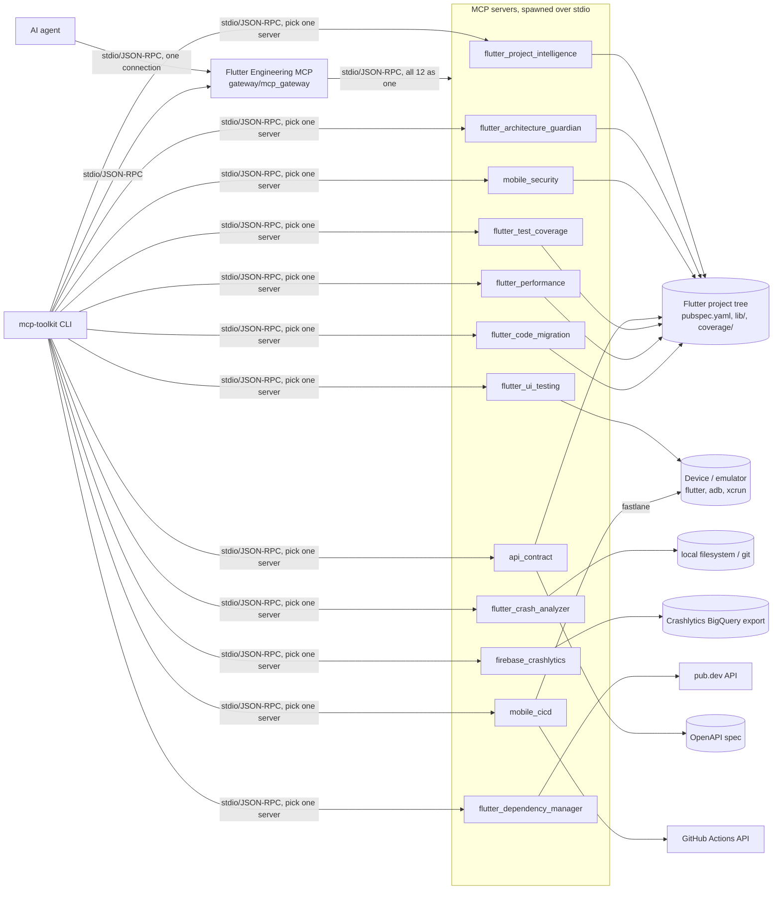

# flutter-mcp-toolkit

Twelve [MCP](https://modelcontextprotocol.io) servers covering the Flutter/mobile development
lifecycle — codebase intelligence, UI testing, crash analysis, Crashlytics, architecture review,
dependency management, mobile security, API contract checking, test coverage, performance
analysis, CI/CD, and code migration — plus one generic CLI client that speaks to all of them over
the real protocol.

This is the Flutter-only spinoff of [mcp-toolkit-ai](https://github.com/rlphjyson/mcp-toolkit-ai),
which also has five general-purpose servers (semantic code search, SQL querying, GitHub Issues,
dev-environment awareness, a Markdown knowledge base). Everything here started as part of that
repo and was duplicated out so it can be installed, versioned, and used independently by anyone
who only cares about Flutter/mobile.

A **Flutter Engineering MCP** gateway (`gateway/mcp_gateway`) sits in front of all twelve: it's
itself an MCP server, but instead of implementing tools directly, it connects to every server in
`servers.toml` as an MCP *client* and re-exposes their combined tools behind one MCP endpoint.
Point an AI agent at the gateway and it gets all twelve servers' tools through a single
connection instead of twelve separate ones — see [`docs/ARCHITECTURE.md`](docs/ARCHITECTURE.md)
for the full breakdown (categories, every tool, setup, and example prompts).

```
                    AI Agent
                       │
                Model Context Protocol
                       │
                       ▼
              Flutter Engineering MCP
       ┌───────────────┼────────────────┐
   Code Intelligence  Architecture   Test Analysis
   Crash Analysis     Dependency     Security Scanning
   Performance        CI/CD          Code Migration
       └───────────────┼────────────────┘
                       ▼
        Flutter Repo · GitHub Actions · Firebase · pub.dev
```

## What makes this one different

Each server is a small, independently-installable Python package exposing MCP tools/resources
over stdio; the CLI is a thin, generic client, not a bespoke UI per server. That keeps every
server's scope tight and lets an AI agent (Claude Code, Claude Desktop, or this repo's own CLI)
drive a Flutter project's entire toolchain — indexing its code, driving a running app, reading
its crash reports, reviewing its architecture, and more — through one consistent protocol.

## Servers

| Server | Package | What it does |
| --- | --- | --- |
| **Flutter Project Intelligence** | `flutter_project_intelligence` | Indexes a Flutter project's widgets, BLoC/Cubit/Riverpod state, GoRouter/named routes, repositories/use cases, API clients, and its own import graph |
| **Flutter UI Testing** | `flutter_ui_testing` | Lists connected devices, launches an app, taps/enters text/scrolls, takes screenshots, and runs `integration_test` files |
| **Flutter Crash & Log Analyzer** | `flutter_crash_analyzer` | Parses Flutter/Dart stack traces, tags likely root causes, and attaches `git blame` for the offending line |
| **Firebase / Crashlytics** | `firebase_crashlytics` | Queries Crashlytics' BigQuery export for top issues, trends, and affected versions |
| **Flutter Architecture Guardian** | `flutter_architecture_guardian` | Flags Clean Architecture / feature-first layering violations via the project's import graph |
| **Flutter Dependency Manager** | `flutter_dependency_manager` | Checks `pubspec.yaml` dependencies against pub.dev for outdated/discontinued packages, plus unused-import detection |
| **Mobile Security** | `mobile_security` | Static scan for hardcoded secrets, insecure `http://` endpoints, unsafe local storage, and risky Android/iOS config |
| **API Contract** | `api_contract` | Compares an OpenAPI spec's schemas/endpoints against Flutter Dart models and API client call sites |
| **Flutter Test Coverage** | `flutter_test_coverage` | Parses `coverage/lcov.info` for low-coverage files, uncovered lines, and source files with no matching test |
| **Flutter Performance** | `flutter_performance` | Analyzes DevTools timeline exports for jank/frame times and `--analyze-size` reports for app-size bloat |
| **Mobile CI/CD** | `mobile_cicd` | Inspects/triggers GitHub Actions runs and runs local Fastlane lanes (the practical path to TestFlight/Play/Firebase App Distribution) |
| **Flutter Code Migration** | `flutter_code_migration` | Scans for legacy patterns (deprecated widgets, Navigator, BLoC) and mechanically applies the subset of renames that are safe to automate |

Each server ships its own `pyproject.toml` and dependency set (`httpx` for the network-backed
ones, `pyyaml` for the pubspec/OpenAPI parsers, plain stdlib for the rest) — the same shape a
real standalone MCP server would take, not one monolith with everything installed. None of them
require a Flutter SDK, Dart analyzer, or connected device to install or test — they operate on a
Flutter project's source tree, config files, and (where relevant) already-produced reports
(`coverage/lcov.info`, a DevTools timeline export, an `--analyze-size` JSON).

### A note on scope for three of the servers

- **Firebase / Crashlytics** has no public per-crash REST API. The real-world way to query it
  programmatically is via its BigQuery export, so that's what this server does — no
  `google-cloud-bigquery` SDK dependency, just `httpx` against BigQuery's REST API with a bearer
  token from `FIREBASE_BIGQUERY_ACCESS_TOKEN` (e.g. `gcloud auth print-access-token`).
- **Mobile CI/CD** scopes to GitHub Actions (via `GITHUB_TOKEN`) and locally-installed Fastlane,
  rather than reimplementing the App Store Connect and Google Play Developer APIs directly —
  Fastlane is itself the standard way a Flutter project already talks to TestFlight, Play
  Console, and Firebase App Distribution.
- **Flutter Code Migration** only auto-applies renames that are genuine 1:1 mechanical
  transformations (e.g. `RaisedButton` → `ElevatedButton`). Navigator → GoRouter and BLoC →
  Riverpod migrations are detection-and-guidance only — those need semantic understanding a
  regex can't safely provide, so `apply_transformation` refuses to touch them.

## Architecture



The CLI reads [`servers.toml`](servers.toml) at the repo root — a registry of short names to
launch commands — and spawns the chosen server as a subprocess per `stdio_client`, the standard
local-MCP pattern. One generic client works with all twelve servers because they all speak the
same protocol.

## Tech stack

- **MCP Python SDK** `mcp>=2.1` (`MCPServer`, not the older `FastMCP` name)
- **httpx** for the pub.dev-, GitHub-, and BigQuery-backed servers
- **PyYAML** for `pubspec.yaml`/OpenAPI parsing
- **Typer + Rich** for the CLI
- Everything else (Dart source scanning, lcov parsing, DevTools timeline analysis,
  `AndroidManifest.xml`/`Info.plist` parsing) is regex/stdlib-based by design — no Flutter SDK or
  Dart analyzer is required to run these servers' tests

## Getting started

Each server and the CLI are independent installable packages. For local dev, install everything
into one shared virtualenv (Python 3.11+):

```bash
python -m venv .venv
source .venv/bin/activate  # or .venv\Scripts\activate on Windows

pip install -e "servers/flutter_project_intelligence[dev]"
pip install -e "servers/flutter_ui_testing[dev]"
pip install -e "servers/flutter_crash_analyzer[dev]"
pip install -e "servers/firebase_crashlytics[dev]"
pip install -e "servers/flutter_architecture_guardian[dev]"
pip install -e "servers/flutter_dependency_manager[dev]"
pip install -e "servers/mobile_security[dev]"
pip install -e "servers/api_contract[dev]"
pip install -e "servers/flutter_test_coverage[dev]"
pip install -e "servers/flutter_performance[dev]"
pip install -e "servers/mobile_cicd[dev]"
pip install -e "servers/flutter_code_migration[dev]"
pip install -e "cli[dev]"
pip install -e "gateway[dev]"
```

`servers.toml` maps short names to launch commands; `command = "python"` means "whichever
interpreter the CLI itself is running under," so no PATH configuration is needed. Servers that
need credentials (`mobile_cicd`'s `GITHUB_TOKEN`, `firebase_crashlytics`'s
`FIREBASE_BIGQUERY_ACCESS_TOKEN`/`FIREBASE_BIGQUERY_PROJECT`) read them via `${VAR_NAME}`
expansion against your own shell environment — the credential itself never lives in the file.

```bash
mcp-toolkit list-servers
mcp-toolkit list-tools flutterintel
mcp-toolkit call-tool flutterintel index_project --args '{"project_path": "/path/to/a/flutter/app"}'

# Or through the Flutter Engineering MCP gateway, one connection for all twelve:
mcp-toolkit list-tools gateway
mcp-toolkit call-tool gateway flutterintel__index_project --args '{"project_path": "/path/to/a/flutter/app"}'
```

## A deliberate MCP security default worth knowing

By default, an MCP server subprocess does **not** inherit its parent's full environment — only a
small, fixed allowlist (`PATH`, `HOME`, etc.). Anything else, like `mobile_cicd`'s `GITHUB_TOKEN`,
only reaches the server if it's explicitly declared in `servers.toml`'s `env` block. This is the
SDK's own choice, not something this repo added — worth knowing before assuming a variable in
your shell will silently show up inside a spawned server.

## Testing

- Every tool function is a plain Python function under a decorator — unit-testable directly, no
  MCP transport needed for most tests.
- External dependencies (pub.dev, GitHub, BigQuery, a real device) sit behind small seams —
  dependency injection (`httpx.MockTransport`), env-var-gated fakes, or fixtures on `tmp_path` —
  so tests don't hit real networks or need real infrastructure/devices.
- At least one true end-to-end test per server spawns the real server subprocess via
  `stdio_client` + `ClientSession` and calls a tool through the actual protocol — including a
  regression test per server confirming that a deliberately-raised, safe error message reaches
  the client rather than the MCP SDK's default generic "Error executing tool X" (the SDK redacts
  any exception that isn't its own `ToolError`/`ResourceError`; every server here wraps its tools
  to convert known-safe exceptions accordingly).

```bash
cd servers/flutter_project_intelligence && ruff check . && mypy flutter_project_intelligence && pytest -q
# ...same for every other server (see servers.toml for the full list), the cli, and the gateway
```

CI runs this matrix (ruff + mypy + pytest) across all twelve servers, the CLI, and the gateway on
every push. The gateway's own tests include a true end-to-end run that spawns the real gateway
process, which in turn spawns two real backend servers — confirming the whole chain (agent →
gateway → backend) actually works over the real protocol, not just each hop in isolation.

See [`docs/ARCHITECTURE.md`](docs/ARCHITECTURE.md) for the full tool reference and setup guide.

## License

[MIT](LICENSE)
