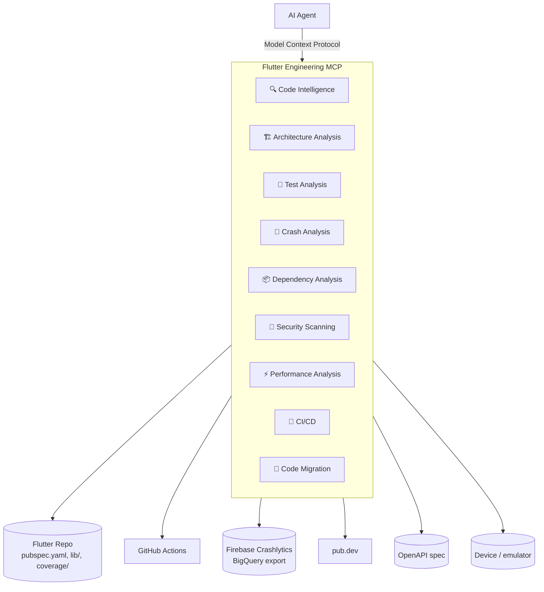

# Flutter Engineering MCP — Architecture & Usage

This document covers the **Flutter Engineering MCP** gateway: what it is, how the twelve
underlying servers are grouped, the full tool reference, how to run it, and example prompts.
For what each individual server does on its own, see the [top-level README](../README.md).

## Why a gateway

Twelve independent MCP servers is the right shape for *building* this toolkit — each one is
small, independently testable, and independently versionable. But it's the wrong shape for
*using* it from an AI agent: registering twelve separate MCP server entries in Claude Desktop
or Claude Code, one per capability, is needless friction for something that's conceptually one
thing — "help me with this Flutter project."

The gateway resolves that by being an MCP server itself, but instead of implementing tools it
connects to all twelve as an MCP *client*, merges their tool lists, and routes each call back to
the right one. The agent sees one connection and one flat tool list; the servers underneath stay
exactly as small and independent as they were.



Nothing about the underlying servers changes: each is still its own installable package with its
own tests, and each is still reachable directly (`mcp-toolkit list-tools flutterintel`) if you'd
rather talk to one specifically. The gateway is an additional front door, not a replacement.

## The nine categories

| Category | Backend(s) | Short name(s) |
| --- | --- | --- |
| 🔍 **Code Intelligence** | Flutter Project Intelligence, API Contract | `flutterintel`, `apicontract` |
| 🏗️ **Architecture Analysis** | Flutter Architecture Guardian | `archguard` |
| 🧪 **Test Analysis** | Flutter Test Coverage, Flutter UI Testing | `flutestcov`, `flutterui` |
| 🐛 **Crash Analysis** | Flutter Crash & Log Analyzer, Firebase/Crashlytics | `crashlog`, `crashlytics` |
| 📦 **Dependency Analysis** | Flutter Dependency Manager | `flutterdeps` |
| 🔐 **Security Scanning** | Mobile Security | `mobilesec` |
| ⚡ **Performance Analysis** | Flutter Performance | `flutperf` |
| 🚢 **CI/CD** | Mobile CI/CD | `mobilecicd` |
| 🔄 **Code Migration** | Flutter Code Migration | `flumigrate` |

(The first eight map directly onto the categories most Flutter engineering-MCP concepts group
by; Code Migration is a ninth this toolkit also covers.)

## Tool reference

Every tool is reachable through the gateway as `<short_name>__<tool_name>` — e.g.
`flutterintel__index_project`. Calling it directly on its own server (bypassing the gateway) uses
just `<tool_name>`, the same as any other entry in `servers.toml`.

### 🔍 Code Intelligence

**`flutterintel` — Flutter Project Intelligence**
| Tool | What it does |
| --- | --- |
| `index_project` | Scans `pubspec.yaml` and `lib/`, building an in-memory index of widgets, state management, routes, repositories/use-cases, and API clients. Call first. |
| `find_symbol` | Case-insensitive substring search by name across every classified symbol in an indexed project. |
| `list_widgets` | Every Widget subclass (and Consumer/Hook variants) in an indexed project. |
| `list_state_management` | Every Bloc, Cubit, and Riverpod Notifier/provider in an indexed project. |
| `list_routes` | Every route, from GoRouter's `GoRoute(path: ...)` and legacy named-route tables. |
| `list_repositories` | Every `*Repository`/`*RepositoryImpl` and `*UseCase` class. |
| `list_api_clients` | Every `*ApiClient`/`*Api` class and other `Dio()`/`http.Client()` usage. |
| `get_file_dependencies` | One file's internal import graph edges (imports and importers). |
| `get_project_dependencies` | The project's own `pubspec.yaml` metadata. |

**`apicontract` — API Contract**
| Tool | What it does |
| --- | --- |
| `load_openapi_spec` | Loads a local or remote OpenAPI 3.x spec, returns a `spec_id`. |
| `list_endpoints` | Every path+method entry in a loaded spec. |
| `find_deprecated_endpoints` | Endpoints flagged `deprecated: true`. |
| `compare_model_to_schema` | Diffs a spec schema's fields against a Dart model class's fields. |
| `find_uncalled_endpoints` | Spec endpoints never called from the project's Dart source. |

### 🏗️ Architecture Analysis

**`archguard` — Flutter Architecture Guardian**
| Tool | What it does |
| --- | --- |
| `analyze_architecture` | Full report of layering violations for `"clean"` or `"feature_first"` style. |
| `list_layer_violations` | Just the violations list. |
| `get_project_layer_summary` | File counts per detected layer/feature. |

### 🧪 Test Analysis

**`flutestcov` — Flutter Test Coverage**
| Tool | What it does |
| --- | --- |
| `parse_coverage_report` | Parses `coverage/lcov.info` into an overall + per-directory coverage summary. |
| `list_low_coverage_files` | Files below a coverage threshold, worst first. |
| `get_uncovered_lines` | Line numbers with zero hits in one file. |
| `find_missing_test_files` | Source files under `lib/` with no matching file under `test/`. |

**`flutterui` — Flutter UI Testing**
| Tool | What it does |
| --- | --- |
| `list_connected_devices` | Devices/emulators/simulators visible to `flutter devices`. |
| `launch_app` | Launches the app on a device, returns a session. |
| `stop_app` | Stops a session. |
| `tap` / `enter_text` / `scroll` | Interacts with the running app. |
| `take_screenshot` | Saves a PNG, returns its path. |
| `run_integration_test` | Runs an `integration_test` file, reports pass/fail. |

### 🐛 Crash Analysis

**`crashlog` — Flutter Crash & Log Analyzer**
| Tool | What it does |
| --- | --- |
| `parse_stack_trace` | Parses a Flutter/Dart exception into structured frames. |
| `analyze_crash` | Parses, tags a likely root cause, and attaches `git blame` for the first project-code frame. |
| `search_log_file` | Regex search over a log file. |
| `tail_log_file` | Last N lines of a log file. |

**`crashlytics` — Firebase / Crashlytics**
| Tool | What it does |
| --- | --- |
| `list_top_issues` | Top crash issues for an app over the trailing N days. |
| `get_issue_details` | One issue's title, counts, first/last seen, fatal flag. |
| `get_crash_trends` | Daily crash counts over the trailing N days. |
| `list_affected_versions` | Per-app-version crash and impacted-user counts for one issue. |

### 📦 Dependency Analysis

**`flutterdeps` — Flutter Dependency Manager**
| Tool | What it does |
| --- | --- |
| `list_dependencies` | Declared dependencies/dev_dependencies with their constraints. |
| `check_outdated` | Latest-version and outdated-flag per hosted dependency, via pub.dev. |
| `check_discontinued_packages` | Packages pub.dev flags as discontinued, with any replacement. |
| `find_unused_dependencies` | Declared packages never imported anywhere in `lib/`. |

### 🔐 Security Scanning

**`mobilesec` — Mobile Security**
| Tool | What it does |
| --- | --- |
| `scan_for_secrets` | Hardcoded API keys/tokens/credentials, redacted in the report. |
| `find_insecure_endpoints` | Hardcoded `http://` URLs (excluding local-dev aliases). |
| `find_unsafe_storage_usage` | Sensitive-looking keys stored via `SharedPreferences` instead of secure storage. |
| `check_android_permissions` | `AndroidManifest.xml` permissions, flagging a sensitive subset. |
| `check_ios_transport_security` | `Info.plist` ATS config, flagging arbitrary-loads/insecure exceptions. |
| `full_security_scan` | Runs all five above and aggregates into one report. |

### ⚡ Performance Analysis

**`flutperf` — Flutter Performance**
| Tool | What it does |
| --- | --- |
| `analyze_timeline` | Frame-time summary (avg/p50/p95/p99, jank count) from a DevTools timeline export. |
| `find_jank_frames` | Frames exceeding a duration threshold, worst first. |
| `count_widget_rebuilds` | Best-effort per-widget rebuild counts from the timeline. |
| `analyze_app_size` | Largest contributors from a `flutter build --analyze-size` report. |

### 🚢 CI/CD

**`mobilecicd` — Mobile CI/CD**
| Tool | What it does |
| --- | --- |
| `list_workflow_runs` | Recent GitHub Actions runs for a repo. |
| `get_workflow_run` | One run's status/conclusion/metadata. |
| `get_run_logs_summary` | Per-job/per-step summary of a run. |
| `trigger_workflow` | Dispatches a `workflow_dispatch` workflow. |
| `list_fastlane_lanes` | Lanes declared in `ios/`/`android/fastlane/Fastfile`. |
| `run_fastlane_lane` | Runs a Fastlane lane (the practical path to TestFlight/Play/Firebase App Distribution). |

### 🔄 Code Migration

**`flumigrate` — Flutter Code Migration**
| Tool | What it does |
| --- | --- |
| `list_available_migrations` | Every supported migration, with mechanical vs. manual-required rule counts. |
| `scan_for_legacy_patterns` | Every match of a migration's rules, with file/line/category. |
| `create_migration_plan` | Scan results grouped by file, with totals. |
| `preview_transformation` | Applies a migration's mechanical rules to one file in-memory, no write. |
| `apply_transformation` | Same, with `dry_run=False` writing the result to disk. Refuses migrations with no mechanical rules at all. |

## Setup

```bash
python -m venv .venv
source .venv/bin/activate
# install every server + the cli + the gateway (see the top-level README for the full list)
pip install -e "gateway[dev]"
```

Credentials some backends need, read via `${VAR_NAME}` expansion in `servers.toml` — never
committed, never hardcoded:

| Variable | Used by |
| --- | --- |
| `GITHUB_TOKEN` | `mobilecicd` (GitHub Actions) |
| `FIREBASE_BIGQUERY_ACCESS_TOKEN`, `FIREBASE_BIGQUERY_PROJECT` | `crashlytics` |

### Running it

Directly:

```bash
cd gateway
python -m mcp_gateway.server
```

Through the CLI, like any other registered server:

```bash
mcp-toolkit list-tools gateway
mcp-toolkit call-tool gateway flutterintel__index_project --args '{"project_path": "/path/to/app"}'
```

Pointed at a different `servers.toml` (useful for testing, or a second Flutter repo with its own
registry):

```bash
MCP_GATEWAY_CONFIG_PATH=/path/to/other/servers.toml python -m mcp_gateway.server
```

### Registering it with an AI agent

In Claude Desktop / Claude Code's MCP server config, point at the gateway instead of the twelve
individual servers:

```json
{
  "mcpServers": {
    "flutter-engineering": {
      "command": "/path/to/flutter-mcp-toolkit/.venv/bin/python",
      "args": ["-m", "mcp_gateway.server"],
      "cwd": "/path/to/flutter-mcp-toolkit/gateway"
    }
  }
}
```

One entry, all twelve servers' tools available, namespaced so nothing collides.

## Behavior worth knowing

- **A backend that fails to start is skipped, not fatal.** If e.g. `crashlytics` can't start for
  some reason, the gateway logs a warning to stderr and serves the other eleven — one broken
  backend never takes down the whole toolkit.
- **Tool names are namespaced**, `<short_name>__<tool_name>`, so `flutterintel`'s and
  `apicontract`'s tools (or any other pair) never collide even if they happened to share a name.
- **Errors come back as real messages, not "Error executing tool X".** An unknown backend name,
  malformed tool name, or a backend call that raises all return a clear `is_error` result with
  the actual explanation — same posture as every individual server's `ToolError` wrapping.
- **Connections are held open for the gateway's whole lifetime**, not re-spawned per call — the
  same cost you'd pay once when connecting an agent to twelve servers individually, paid once
  here too, just behind one connection instead of twelve.

## Example prompts

With the gateway wired into an agent, requests can span categories in one turn:

> "Index this Flutter project, then tell me which BLoCs have no corresponding test file."
> *(`flutterintel__index_project` → `flutterintel__list_state_management` → `flutestcov__find_missing_test_files`)*

> "Run a full security scan and check if any of the flagged Android permissions actually get used
> near a network call."
> *(`mobilesec__full_security_scan` → `flutterintel__list_api_clients`)*

> "Here's a stack trace from a user report — find the likely cause and check if it's already
> covered by an open GitHub Actions run."
> *(`crashlog__analyze_crash` → `mobilecicd__list_workflow_runs`)*

> "Check the project for outdated dependencies and any RaisedButton usages we should clean up
> while we're at it."
> *(`flutterdeps__check_outdated` → `flumigrate__scan_for_legacy_patterns`)*
